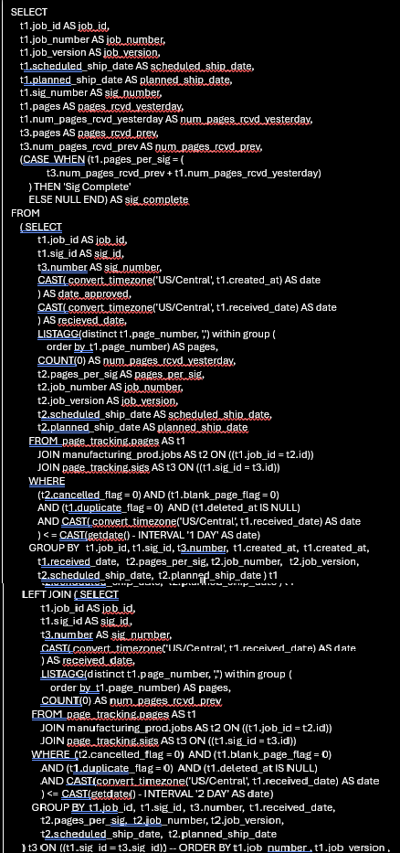

# AWS-Integration of multiple platforms(with muliple databases)-to-Redshift 
## A project that I’ve worked on, independently, that I am very passionate about...
Constructing pipelines to migrate data from MySQL workbench-RDS, Oracle and salesforce to a central location, Redshift.  Upon completion, allowing different teams to have access to varying databases

## Solution: Completed in multiple stages.  
### MYSQL-to-Redshift
      First, MySQL workbench required JDBC and terraform connection.  
      Followed by a crawler who would gather the schema and transfer it to a data catalogue.  
      Once the foundation was laid in the catalogue, glue ETL jobs, visual ETL, interactive notebooks,
      lambda used to facilitate the transfer.  
      To assure the data was updated, a pipeline including crawlers, triggers, and glue jobs were used(diagram). 
      Monitoring and maintenance were done daily with CloudWatch, resource usage, Job type breakdown, 
      Worker type breakdown, Job runs timeline.

  

### Oracle to Redshift
      Oracle migration took a different means of transfer. 
      The tables first needed to be modified to MATERIALIZED VIEW format 
      and then transferred to Redshift.  
      This was accomplished by exporting and then copying. Example of M.V.

  

### Salesforce to Redshift
      Salesforce migration was carried out through Appflow.  
      Flow setup started with connecting to source, mapping source fields 
      to destination then activating flows.  Other necessary tasks included:
            setting up KMS key, Field mappings stored in S3 as parquet format, 
            triggers set at on demand. Monitored through CloudWatch metrics.
      
      Setting up IAM roles and establishing policies allowed for different teams to 
      have access to varying databases.

   

#### Where did you find the solutions?  
      Researching different architectural solutions for the various sources 
      and the alterations in schema design to allow for acceptable conversions to Redshift.
 
#### Why did the solution work?
      Organization, collaboration with multiple teams, excellent research skills
 
#### How were you sure the solution worked?
      Data Validation records displayed results consistent with the original database.

### Cloud Watch Dispayed in Organized Fashion in IDE
      In my role, I built a connection to the log files in serverless data integration service.
      To achieve this, I accessed the log files, organized them by table(operation), 
      built a pipeline to display the results on Redshift allowing for immediate 
      access to status of the tables. 

   

